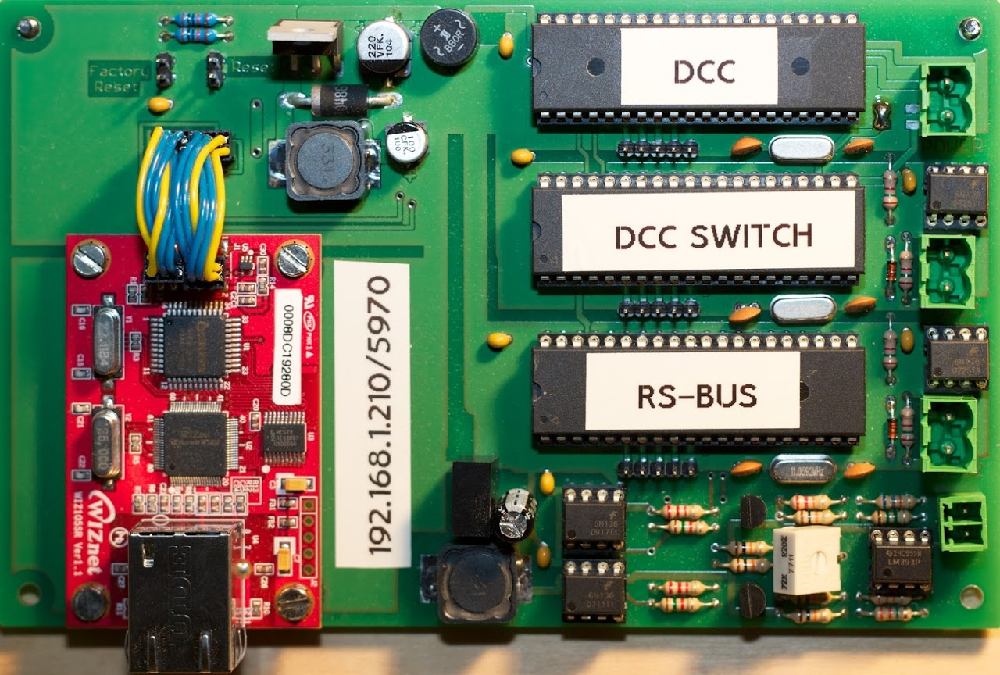

# DCCMonitor
Monitoring system to debug potential problems on a DCC digital controlled model train system

## Summary
* Monitor both the DCC- and the RS-bus, allowing to correlate commands and feedbacks.
* Chain multiple "single-input" boards together, using just a single serial or Ethernet port on the PC<./li>
* Easy to build (no SMD) and cheap hardware.
* Compatible with the Lenz LAN/USB Interface (23151).
* Fully open source.

  

## Versions
There are two versions of both monitor hardware and monitor software:
* The first version of the hardware was developed by Peter Lebbing and allows monitoring of a single DCC- or (via an extension board) RS-bus signal. Multiple of these "single-input" boards can be connected to each other (daisy-chained).
* The second version of the hardware is basically an integration of multiple "single-input" boards (two DCC and one RS-bus), plus the addition of an Ethernet interface. The advantage of such "multi-input" board is that wiring gets simpler, and a single power-source suffices.
* The first version of the software was developed by Peter Lebbing and provides a simple command line interface. The software runs on Linux, Windows and Mac OSX, and is limited in its capabilities to the most common DCC packets.
* The second version of the software is a rewrite from scratch, decodes (nearly) all DCC packets and provides a Graphical User Interface (GUI) for MAC OSX (for OSX 10.6 or higher). It has been designed with the "multi-input" hardware board in mind, but can additionally decode RS-bus feedback signals via Lenz's own LAN/USB Interface (serial number: 23151). Although it expects input via the Ethernet interface, the software can still be used together with the "single-input" monitoring boards, provided a serial-to-Ethernet converter is being used.

A description of this decoder and related decoders can be found on [https://sites.google.com/site/dcctrains](https://sites.google.com/site/dcctrains).
The hardware and schematics can be downloaded from my [EasyEda page](https://easyeda.com/aikopras/dcc-monitor). 
The original source by Peter Lebbing can be found [here](http://digitalbrains.com/2012/dccmon).
